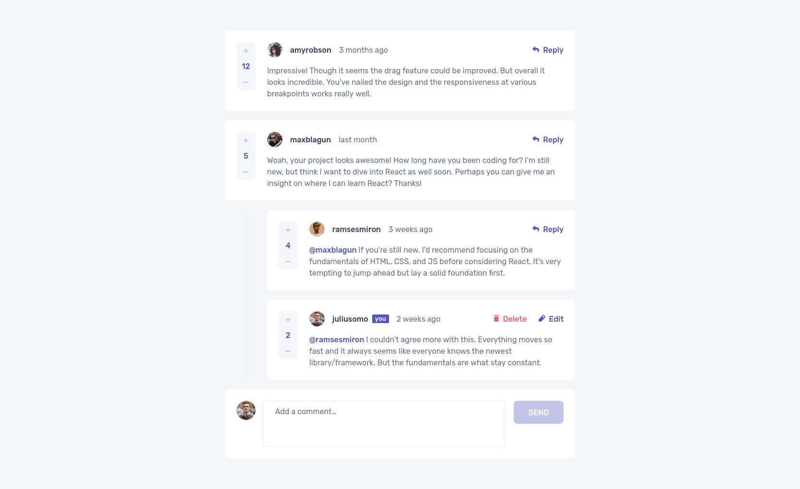
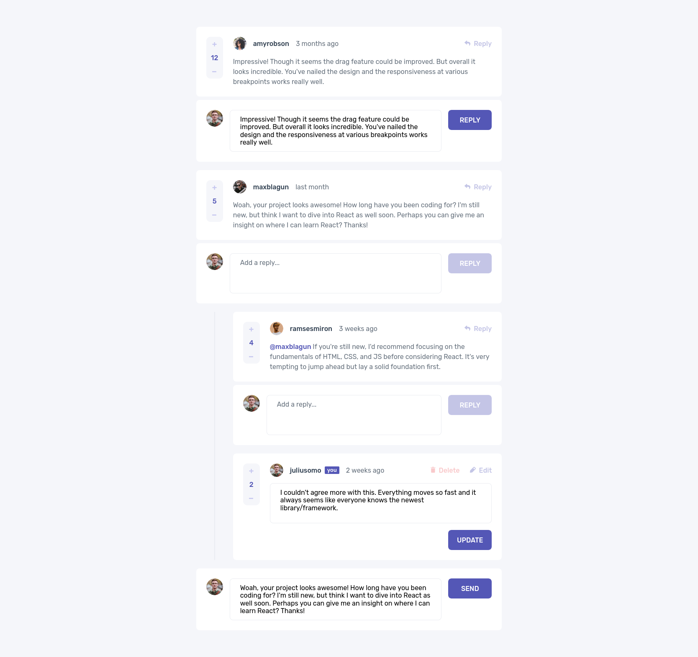
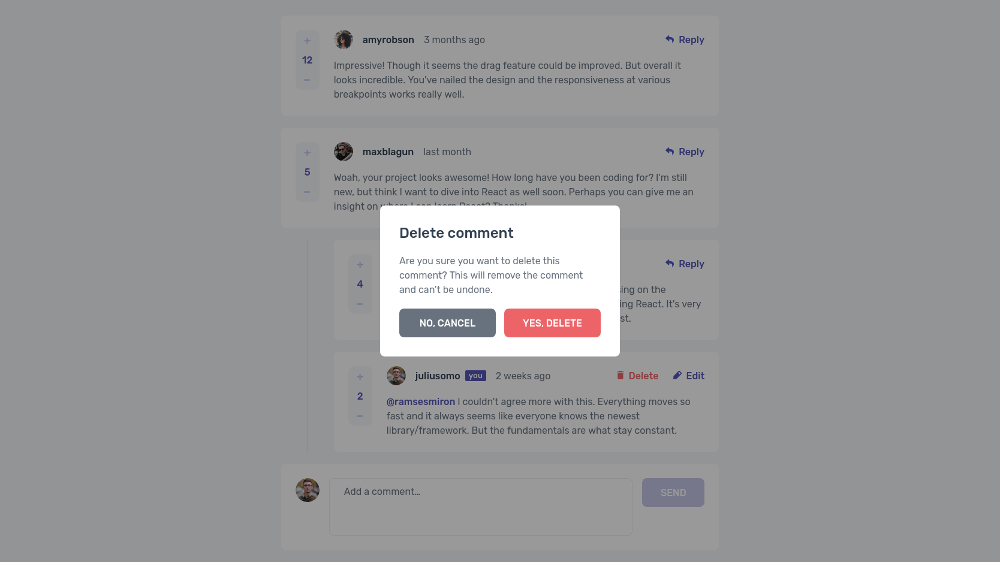

# Frontend Mentor - Interactive comments section solution

This is a solution to the [Interactive comments section challenge on Frontend Mentor](https://www.frontendmentor.io/challenges/interactive-comments-section-iG1RugEG9). Frontend Mentor challenges help you improve your coding skills by building realistic projects. 

## Table of contents

- [Overview](#overview)
  - [The challenge](#the-challenge)
  - [Screenshot](#screenshot)
  - [Links](#links)
- [My process](#my-process)
  - [Built with](#built-with)
  - [What I learned](#what-i-learned)
  - [Continued development](#continued-development)
  - [Useful resources](#useful-resources)
- [Author](#author)

## Overview

### The challenge

Users should be able to:

- View the optimal layout for the app depending on their device's screen size
- See hover states for all interactive elements on the page
- Create, Read, Update, and Delete comments and replies
- Upvote and downvote comments
- **Bonus**: If you're building a purely front-end project, use `localStorage` to save the current state in the browser that persists when the browser is refreshed.
- **Bonus**: Instead of using the `createdAt` strings from the `data.json` file, try using timestamps and dynamically track the time since the comment or reply was posted.

### Screenshot

### Links

- Solution URL: [Frontend Mentor Solution](https://www.frontendmentor.io/challenges/interactive-comments-section-iG1RugEG9/hub/interactive-comments-using-react-js-scss-bem-Fg1k_Mdhm)
- Live Site URL: [Github Pages](https://rzvr.github.io/interactive-comments-section/)

## My process

### Built with

- HTML
- CSS/SCSS
- JavaScript
- [React](https://reactjs.org/) - JS library

### What I learned

During the creation of this project, I learned the basics of React and hooks. It was difficult for me to destructure the code due to the data structure that was provided in the challenge. I did not find a good solution for managing the comment replies functionality, so I had to almost completely duplicate the comment component and reply component with modifications for replies. In this challenge, I focused more on logic and paid less attention to semantics and accessibility. 

### Continued development

In the next challenges, I will improve my skills in writing a React application and pay more attention to semantics and accessibility for users. I'm also interested in Redux.

### Useful resources

- [Monsterlessons Academy Youtube](https://www.youtube.com/watch?v=sjAeLwuezxo) - This video helped me during the project in solving problems.
- [Skillthrive Youtube](https://www.youtube.com/watch?v=JfNjGLGaxR4) - Here I saw how to create a reusable button component.
- [Skillthrive Youtube RU](https://www.youtube.com/watch?v=GNrdg3PzpJQ) - I also got my knowledge from here.

## Author

- Github - [rzvr](https://github.com/rzvr)
- Codewars - [rzvr](https://www.codewars.com/users/rzvr)
- LinkedIn - [Roman Zvir](https://www.linkedin.com/in/roman-zvir-8a4394214)
- Frontend Mentor - [rzvr](https://www.frontendmentor.io/profile/rzvr)